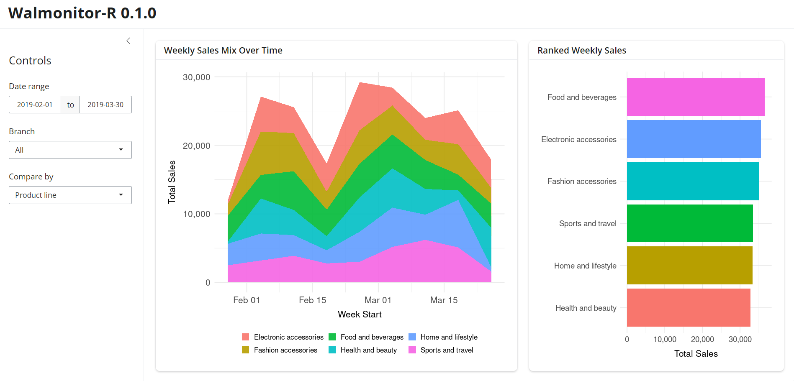

# Walmonitor-R

[Walmonitor](https://github.com/UBC-MDS/DSCI-532_2026_2_walmonitor) is an interactive dashboard for visualizing the performance of Walmart stores across different branches and time periods.

This app is a simplified re-implementation of Walmonitor using [Shiny for R](https://shiny.posit.co/r/getstarted/shiny-basics/lesson1/). It removes the time-series line-plot and the aggregation control options. As a result, this dashboard highlights comparisons of **weekly total sales** by product line, payment, gender, or customer type.



## Get started

Click [here](https://yhouyang02-walmonitor-r.share.connect.posit.cloud/) to view the latest stable release of this dashboard. You may need to adjust your browser zoom level to reach the best view.

You can also run the app locally by following the below instruction. This project repo is set up to easily reproduce the required dependencies with `renv`. We recommend [RStudio](https://posit.co/downloads/) for a smooth experience.

1.  Make sure to have [R](https://www.r-project.org/) installed in your system before continuing. In your **terminal** verify your installation and version.

    ``` bash
    R --version  # expect version 4.5.2 or higher
    ```

2.  In your **terminal**, clone this repository.

    ``` bash
    git clone https://github.com/yhouyang02/walmonitor-R.git
    ```

3.  In your **terminal**, navigate to the project directory and activate **R console**. *If you are using RStudio, open `walmonitor-R.Rproj` from the cloned repo instead.*

    ``` bash
    cd walmonitor-R
    ```

    ``` bash
    R
    ```

4.  In **R console**, restore the `renv` environment (recommended). Alternatively, you can install each dependency directly.

    ``` R
    install.packages("renv")
    renv::restore()
    ```

    ``` R
    # Not required if using renv. 
    # If you encounter any errors, follow the above approach.
    install.packages(c(
      "shiny", "bslib", "dplyr", "ggplot2",
      "readr", "lubridate", "forcats", "scales",
    ))
    ```

5.  In **R console**, run the Shiny app.

    ``` R
    shiny::runApp()
    ```

6.  The dashboard should load automatically. If not, check the console for the local URL (e.g., `http://127.0.0.1:3236`) and paste it to your web browser.

7.  Click `Ctrl + C` to stop the app from your **R console**.
